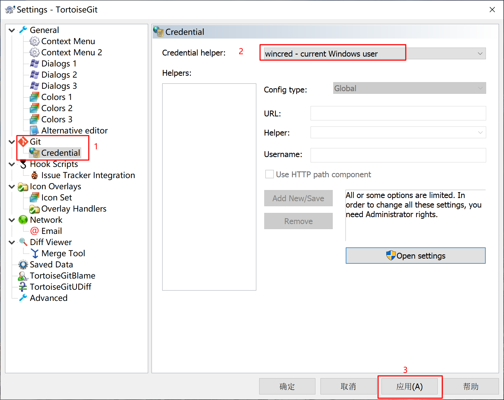

## 安装Git

- [Git下载地址](https://git-scm.com/downloads)
- [TortoiseGit下载地址](https://tortoisegit.org/download/)

## 重置Git账号密码

- 来源：[git提交代码权限问题报错记录](https://blog.csdn.net/qq_33326449/article/details/91363694)
- 报错信息
    ```
  git.exe push --progress "origin" master:master
  remote: HTTP Basic: Access denied
  fatal: Authentication failed for 'http://gitlab.xxxxxxx.com/huangyufeng/zcm-cmdb.git/'
  ```
- 问题分析
    - 用户没有赋权
    - 用户密码更改
    - Tfs账号问题
- 解决方案
    - 在**管理员模式**的GitBash.exe中执行命令
    ``git config --system --unset credential.helper``
    - 永久保存密码
    ``git config --global credential.helper store``

## Git设置永久记住密码

- 来源：[TortoiseGit save user authentication / credentials - Stack Overflow](https://stackoverflow.com/questions/14000173/tortoisegit-save-user-authentication-credentials)
- 配置步骤：To use: Right click → TortoiseGit → Settings → Git → Credential. Select Credential helper: wincred - this repository only / wincred - current Windows user
- 

- 拉取远程仓库，更新远程分支
	```
    git remote update origin --prune
    >>Fetching origin
    git remote prune origin
  ```

## Git全局配置用户信息

* 全局配置用户名和邮箱
	```
  git config --global user.name [username]
  git config --global user.email [email]
  ```
```

* 查询用户信息

```
  git config --list
  ```

  
  ```