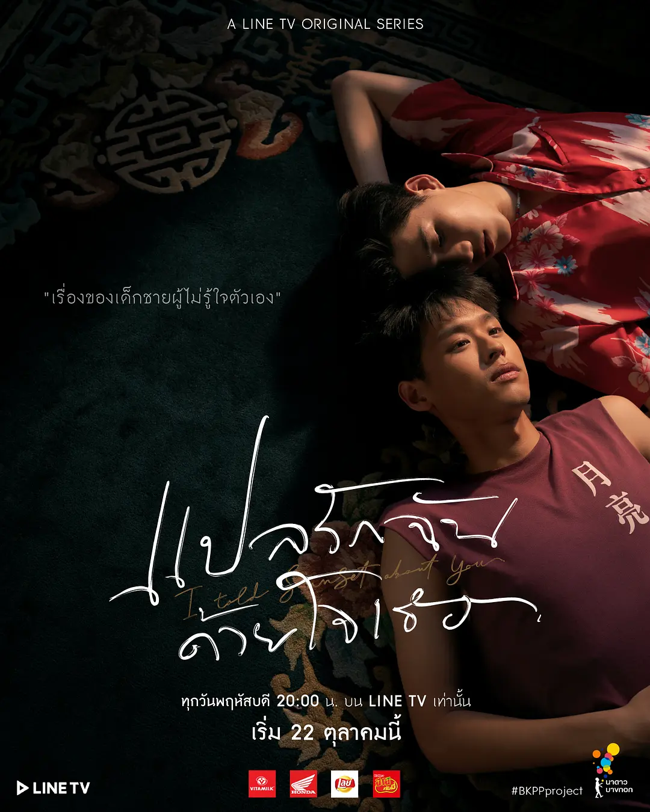

## 剧情简介

* [以你的心诠释我的爱 (豆瓣)](https://movie.douban.com/subject/34979008/) 评分：9.3
* 

## 观后感

- 受朋友和播客《井户端会议》推荐看的，泰国出品5集迷你腐剧，一播出就受到网络的热议，豆瓣评分9+。
  - [《以你的心诠释我的爱》：9.4分泰剧呈现出的“青春的荒乱”](https://www.xiaoyuzhoufm.com/episode/5fc1ae83dee9c1e16d09e024?s=eyJ1IjoiNWVjYmZkYmUyODM3YjIwODVkMDAxZDQxIn0%3D )
- 一口气看了前四集，男一和男二小时候因为一些嫌隙断了联系（从小做事三分钟热度的男二在第一次上台表演，演的就是男一的启蒙角色，然后点燃了男二对表演的热情，向男一表示以后要当一个演员，而男一认为男二抢了自己表演的梦想，两人从此断了联系），故事一下子到了高中，两人在中文补习班再次相遇，男一成绩优异处处挑衅男二，之后又经历一顿电视剧常见套路后，两人暗生情愫却又有误会，男一最后还把保送名额让给男二。
- 最后一集我是后来才补看的，在看完前四集后，肾上腺素突然没有一丝丝变化，从两人眼神里无法感受到love的感觉，一度弃剧，从弯到直无缝切换，觉得140字微博就能讲完的故事，愣是拍了5个小时连续剧，甚至最近还要拍第二季。
- 两点接受无度，一是小攻哭妆丑出天际，二是攻受眼神无爱硬凑cp。
- 于是跟友友们吐槽：
  - “k到底为什么爱上p，因为他们有一样的梦想吗？”
  - “突然觉得我没看懂耶，顾着嫌弃他们的哭妆了。”
  - “所以到底因为什么在一起？我想不明白。”
  - “那就别看了哈哈。”