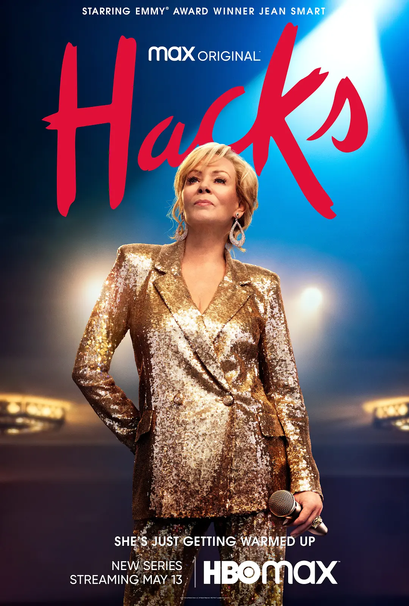

## 剧情简介

* [绝望写手 第一季 (豆瓣)](https://movie.douban.com/subject/35445834/) 评分8.5
* 
* [绝望写手 第二季 (豆瓣)](https://movie.douban.com/subject/35524211/) 评分9.2
* 

* 一句话介绍：双女主，女一是个单口喜剧演员，女二是个双，正值穷困潦倒、事业爱情双失利的时候，两人的共同经纪人，把女二介绍给女一当写手（写喜剧段子）。

## 观后感

刷完《绝望写手（Hacks）》1、2两季，算是新冠三年以来看过最满意的美剧（虽然近来看的剧也不多，坚持看完的更是了了）。每集30分钟，双女主剧，喜剧效果拉满，非推理悬疑剧直接看到起鸡皮疙瘩实属少见，剧里谈及性取向，时不时包含性尺度话题，让我想推荐给别人，又不敢推荐，还是自己偷偷私藏吧，坐等第三季。

**"请拍到Deborah 109岁！"**

编剧台词精彩绝妙，明明语速不快，因为太过精彩导致经常回退重看。抛开剧情，单论俩主角演技，也是一身鸡皮疙瘩，台词吐字清晰有力，眼神表情张扬有度，在国无脑无演技的剧衬托下，实在很难不爱。

剧情片段代入感实在太强，二刷安排。

**“为什么一个男人疯了，大家都认定他是个天才？为什么一个女人疯了，大家只想把她关进精神病院？”**