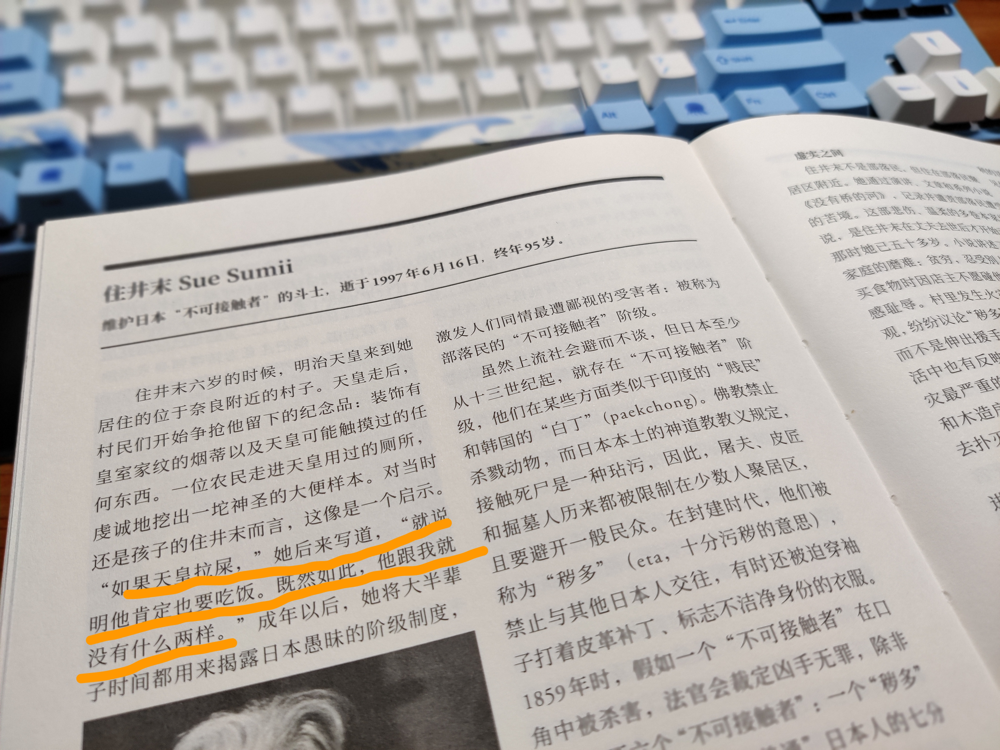

> 维护日本“不可接触者”的斗士，逝于1997年6月16日，终年95岁。

## 书籍简介

* 著作：[[《没有桥的河》]] | [电影-没有桥的河流 (豆瓣)](https://movie.douban.com/subject/3129754/) | [书籍-没有桥的河 (豆瓣)](https://book.douban.com/subject/2028635/)

## 读后感

* 读到此篇文的当天，在微博社交平台发生了一些关于“彩虹”之事，一时无语又想发声又不知该在哪里表达。
* 太多的不可说，社会进步的当下有人因不可说之事被处分。这是不是就是“倒退”呢？华夏大地，自然情感下竟只能容纳一种“性别”的情感。
* 正好借此篇，心里面浮现出一幅画——日本大和民族下的一群“不可接触者”。

​	

## 摘抄

* P354 “如果天皇拉屎，”她后来写道，“就说明他肯定也要吃饭。既然如此，他跟我就没有什么两样。”成年以后，她将大半辈子时间都用来揭露日本愚昧的阶级制度，激发人们同情最遭鄙视的受害者：被成为部落民的“不可接触者”阶级。
* P355 对许多日本人来说，住井末的作品是他们了解“不可接触者”的唯一窗口。日本媒体几乎从来不报道这个题材，触及部落民问题的外国书籍，都在被翻译成日文时删掉了有关论述。
* P355 这种掩盖部落民问题的沉默，也在一定程度上反映出编辑们面对这一社会现状时的尴尬窘迫：在日本所谓的和谐社会中，竟存在一个备受欺辱的少数群体。
* P355 没有哪家报社或电视台能够跟得上联盟不断变化的要求，例如提及部落民时哪些词可以接受，哪些词不可以，因此大部分媒体选择完全避开这一话题。住井末的作品是这一规则唯一显著的例外。	