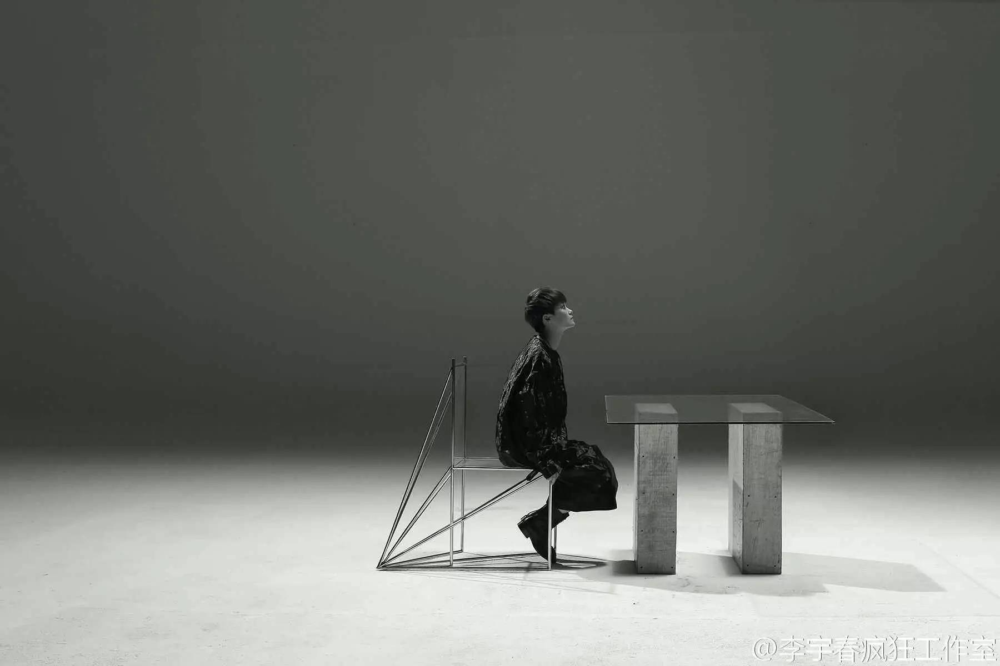

五年前的今天什么感觉已经不记得了，但三个月后我遇到了“不自觉微笑”～有些人就是注定会陪着你度过灰色时光的～感谢你感动我～
我们让彼此的人格完整了，毕业后她成了我，我成了她。
我比较在意精神世界，这一年都在开发学习加班忙碌，但是因为这样，才真正意识到某人的重要
因为毕业了，但有些路是重合的，我们还是会彼此照应，我很暖心
我们的相处时近乎“老夫老妻”式的
如果我的坚强任性会不相信伤害到你，你能不能温柔提醒，我虽然心太急，更害怕错过你。负气的我变得成熟了，谢谢你～

