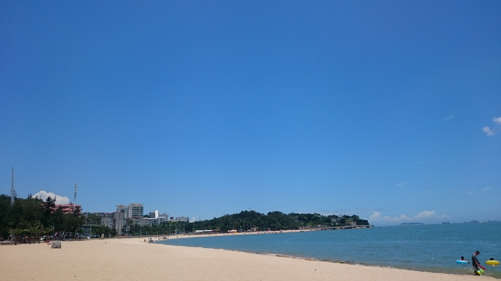
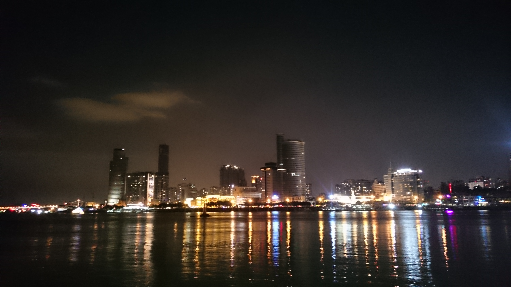

又是一年毕业季，转眼我也是毕业一年的职场人了，再也不能自称应届生的尴尬年纪；也算是狂欢季吧，向来忙碌的两只大学舍友来厦门找我，呆了两天，带着两只“跑遍景点，游山玩水，逛断了腿，累酸了腰，闪亮亮的两万步，骄傲的占领微信运动榜首”。

我才发现对于自己所在城市的陌生、不熟悉，归根结底还是太宅，亦或是没有找到同行的人儿。
对于她们，有一种特别的情愫在，很温暖，很舒服，很默契。

老朋友在一起，吃一吃、逛一逛、聊一聊、睡一睡，仿佛一切又回到了大学宿舍里的那个吃着冰西瓜的夏天。不经意间感概十分，吃过最甜的西瓜还得是那年夏天一起在阿姨水果店里买的那次。
傍晚，送两只去搭动车。看着她们检票，突然热泪盈眶，好久不见，谢谢你们来看我，欢迎来到有我的城市。
期待下次的小碰面~

